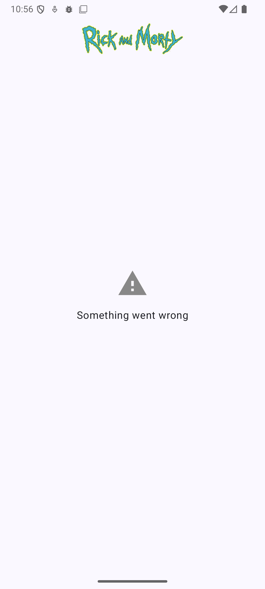
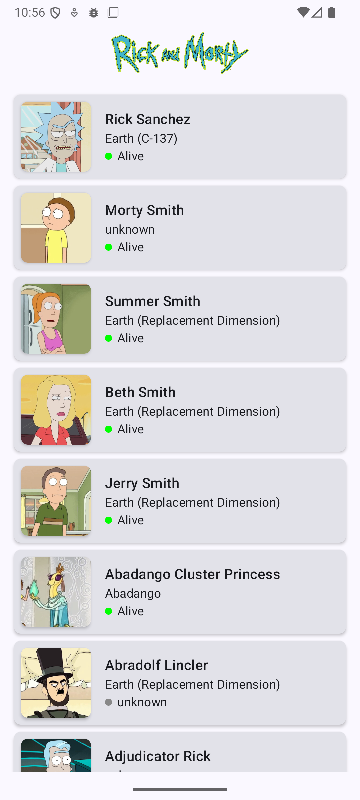

# Rick & Morty Challenge App

This Android project is a **challenge project** that demonstrates fetching and displaying a list of characters from the **Rick and Morty API** using modern Android development tools and best practices.

  
  

## Architecture

The project is built using **Clean Architecture** and **MVI (Model-View-Intent)** pattern:

**Why Clean Architecture?**  
Clean Architecture separates the code into layers with distinct responsibilities, which improves maintainability, testability, and scalability. Each layer depends only on the layer below it, avoiding tight coupling and making it easier to replace or extend features in the future.

**Why MVI?**  
MVI is used for **predictable state management** in the UI. With a single source of truth (the ViewState) and unidirectional data flow, it simplifies handling UI states like loading, success, and error. Events trigger state changes, and Effects handle one-time actions like navigation or showing a toast.

### Layers
- **Domain**: Contains use cases and business logic.
- **Data**: Handles data sources, repositories, and DTOs.
- **App**: Contains UI code implemented with **Jetpack Compose** and ViewModels.

## Features

- Fetches a list of Rick and Morty characters.

## Dependencies
- [Jetpack Components](https://developer.android.com/jetpack)
    - [Jetpack Compose](https://developer.android.com/jetpack/compose)- Modern Android UI toolkit for building native UIs using a declarative syntax.

    - [Android KTX](https://developer.android.com/kotlin/ktx.html) -  Android KTX is a set of Kotlin extensions that optimize Android development with Jetpack and other Android libraries.

    - [AndroidX](https://developer.android.com/jetpack/androidx) - AndroidX is a set of libraries that provides backward-compatible versions of Android framework APIs.

    - [ViewModel](https://developer.android.com/topic/libraries/architecture/viewmodel) - ViewModel is a class designed to store and manage UI-related data in a lifecycle-conscious way.

- [MVI Architecture]() -  MVI (Model-View-Intent) Architecture is a unidirectional data flow architectural pattern commonly used in Android development for managing UI components and application state.

- [Coroutines](https://github.com/Kotlin/kotlinx.coroutines) - Kotlin coroutines provide support for asynchronous programming in Kotlin. They allow you to write asynchronous code sequentially, making asynchronous programming easier to read and write.

- [Flows](https://developer.android.com/kotlin/flow) - Kotlin Flows are a cold asynchronous data stream that sequentially emits values and completes normally or with an exception. They are built on top of Kotlin coroutines and designed to be efficient.

- [Hilt](https://dagger.dev/hilt/) - A dependency injection library for Android that reduces the boilerplate of doing manual dependency injection in your project.

- [Retrofit](https://square.github.io/retrofit/) - Retrofit is a type-safe HTTP client for Android and Java.

- [GSON](https://github.com/google/gson) - Gson is a Java library used for serializing and deserializing Java objects to and from JSON.

- [OkHttp Logging Interceptor](https://github.com/square/okhttp/blob/master/okhttp-logging-interceptor/README.md) - OkHttp Logging Interceptor is an OkHttp interceptor which logs HTTP request and response data.

- [Coil](https://github.com/coil-kt/coil) - Coil is an image loading library for Android backed by Kotlin Coroutines. It is designed to be fast, lightweight, and easy to use.

- [Rick and Morty API](https://rickandmortyapi.com/documentation) - The Rick and Morty API is an online database that provides information about Rick and Morty characters.

